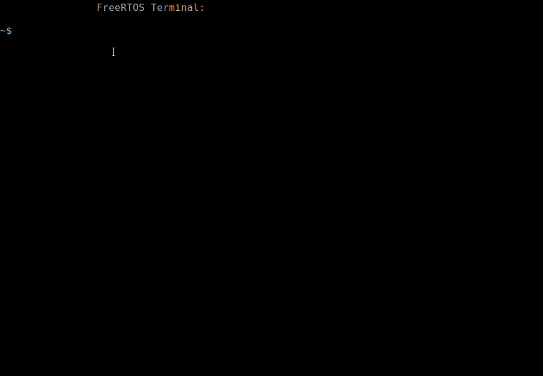

# UARTConsole_Tiva_freeRTOS
UART Console project for Tiva Connected TM4C1294XL with FreeRTOS+CLI command line interface.

This example contains 5 available commands:
* **help:**   Show all commands
* **led:**    Turns LED 0 ON or OFF
* **echo:**   Returns what was typed
* **clear:**  Clean the console
* **color:**  Change the text color

This project was based on the [video](https://youtu.be/SJj43HkXtq0) shared by  [Gustavo Denardin](https://github.com/gustavowd).


## Screenshots




## Requirements

The project was developed on **Code Composer Studio Version: 10.1.0.00010**

The CCS Project was created and configurated exactly like the images below:


Change here **/home/victor/ti/tivaware** to your **tivaware** path


Also here...


That's all !

## How to use
Run the commmand:

```bash
victor@victorUTF:~$ dmesg | grep tty
  [    0.090095] printk: console [tty0] enabled
  [ 1950.239035] cdc_acm 1-1:1.0: ttyACM0: USB ACM device
  [32232.341969] cdc_acm 1-1:1.0: ttyACM0: USB ACM device
```
Connect in **dev/ttyACM0** serial port, using **GtkTerm**, and
set to **115200 8-N-1**.

Type **help** to see tips for all the available commands.

